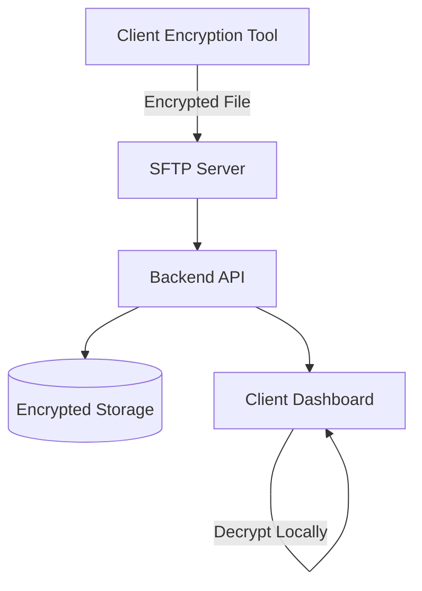

# Technical Design Document

## System Architecture
The system follows a zero-trust encryption-first architecture where sensitive data is encrypted at the client and only decrypted under strict controls.



## Data Model
### user_records
- `id` (UUID)
- `encrypted_payload` (JSONB / BYTEA)
- `key_id` (VARCHAR)
- `created_at` (TIMESTAMP)

### audit_logs
- `id` (UUID)
- `user_id`
- `record_id`
- `action` (VIEW_DECRYPTED)
- `timestamp`
- `ip_address`

## API Design
### Upload Metadata
`POST /api/v1/records`
```json
{
  "file_reference": "s3://bucket/object",
  "key_id": "client-key-001"
}
```

### Fetch Records
`GET /api/v1/records`
```json
{
  "id": "uuid",
  "masked_data": { "pan": "XXXX1234" }
}
```

### Request Decryption Token
`POST /api/v1/records/{id}/reveal`
- Auth: JWT + RBAC
- Response: Time-bound decryption token

## Performance & Scalability
- Masked data fetch < 200ms (p95)
- Support 10k+ records per client
- Horizontal scaling via stateless APIs
- Object storage for large encrypted payloads

## Security & Compliance
- AES-256-GCM for data encryption
- Unique IV per encryption operation
- Client-side decryption preferred
- Audit logs immutable and retained for compliance
- HIPAA / GDPR-aligned data handling principles

## Risks & Mitigation
| Risk | Mitigation |
|-----|-----------|
| Key leakage | Use KMS + never store raw keys |
| Unauthorized access | RBAC + MFA |
| Client-side crypto misuse | Well-tested crypto libraries |
| Performance overhead | Encrypt only sensitive fields |

## Notes
This design intentionally minimizes plaintext exposure and aligns with enterprise healthcare data security standards.

